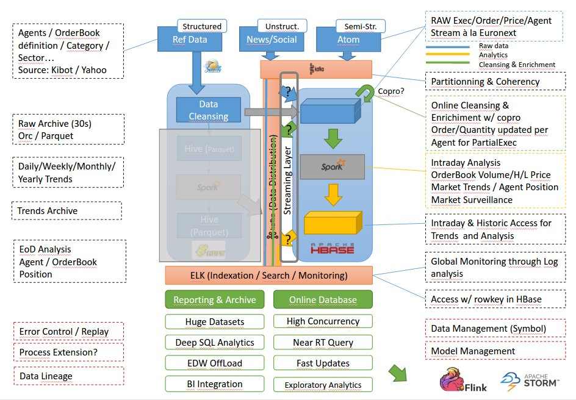

# Streaming platform

How to ingest million of transactions every day and produce accurate reporting in near real-time? This is the challenge that we face nowadays in Financial industry. 

Front-Office, Risk Management and Compliance used to be separate systems with different workload: online interaction and real-time analytics in intraday on a side, batch and consolidated reporting on the other.

Things as change, regulatory report and risk monitoring needs to be perform in intraday. Trading desk are looking for opportunities in by having a 360 vision of their customers.

Technologies such Big Data and Reactive sytems offer now the possibilities to build innovative Financial Platform to face all these challlenges.

This project aims to build a unify solution that offers a way to produce intraday report based on streaming data in reactive manner. The platform use an event driven architecture with Big Data components such as HBase, Spark, Kakfa, Elasticsearch and so on...

## How to contribute

### Slack 
We will use a collaborative communication platform to facilitate the discussion on this project. 
To join the team Finaxys Slack, you must register through the link https://finaxys.slack.com/signup

### Trello
We will use a project management tool online to manage the project development and the different steps of completion.
To view the Trello board of the project https://trello.com/b/2o0uBcrB/finaxys-streaming-platform, you must:
* Have a Trello account
* Have access to the project board (ask access to adouang on Slack)

### Our cluster

*TODO Give the access informations*
* *Hosts*
    - master01.cl02.sr.x2p.fr 195.154.134.135 finaxys far4.pif
    - worker01.cl02.sr.x2p.fr 195.154.134.136 finaxys1 finaxys1
    - worker02.cl02.sr.x2p.fr 195.154.134.137 finaxys1 finaxys1
* *Web UI*
    - Ambari interface : master01.cl02.sr.x2p.fr:8080 admin requin
    - HDFS interface : master01.cl02.sr.x2p.fr:50070
    - HBase interface : master01.cl02.sr.x2p.fr:60010
    - YARN interface : worker01.cl02.sr.x2p.fr:8088
    - Spark interface : worker01.cl02.sr.x2p.fr:18080

